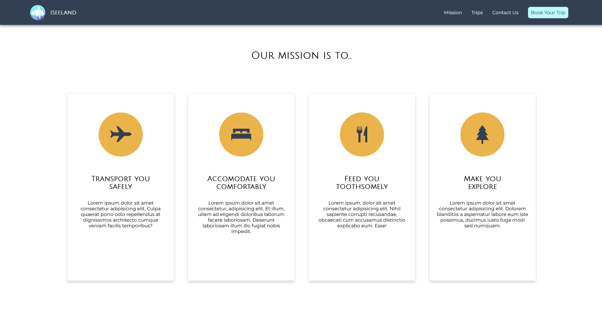
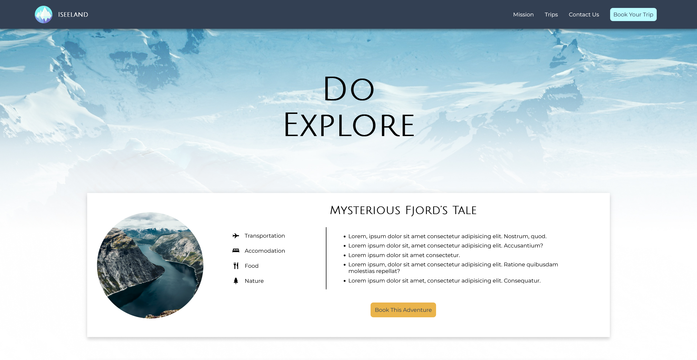

# Iseeland

This was my own first project after completing DevEd's Creative HTML5 & CSS3 Course and it was prepared back in October 2021. It's a travel agency's website presenting offered trips to Iceland.

## Table of contents

- [Overview](#overview)
  - [The challenge](#the-challenge)
  - [Screenshot](#screenshot)
  - [Links](#links)
- [My process](#my-process)
  - [Built with](#built-with)
  - [Continued development](#continued-development)
  - [Useful resources](#useful-resources)
- [Author](#author)

## Overview

### The challenge

This project was created to use my theoretical HTML and CSS knowledge in practice. The biggest challenge was to properly postion and size cards and images on the Trips page on different devices. I'm proud of the design though, as I prepared it myself in Figma.

### Screenshot

### Links

- Live Site URL: [Iseeland](https://dreamy-franklin-45a380.netlify.app/)

## My process

### Built with

- Semantic HTML5 markup
- SASS
- Flexbox
- Figma (design)

### Continued development

As it was my first project and my understanding of HTML and CSS got better I'm going to rebuild it with mobile-first approach and reduce number of media queries that now is absolutely crazy ;D I'd also like to add some
slight animations and add booking functionality (e.g. calendar, price, number of guests, email confirmation etc) with JavaScript.

### Useful resources

- [DevEd's courses](https://developedbyed.com/) - His course helped me learn HTML and understand CSS via practical examples and projects
- [DevEd's YouTube channel](https://www.youtube.com/c/DevEd) - He has also great free resources that got me interestend in frontend in the first place

## Author

- LinkedIn - [Lidia Krajewska](https://www.linkedin.com/in/lidia-krajewska-02512a1a7/)
- Frontend Mentor - [@lidiakrajewska](https://www.frontendmentor.io/profile/lidiakrajewska)
